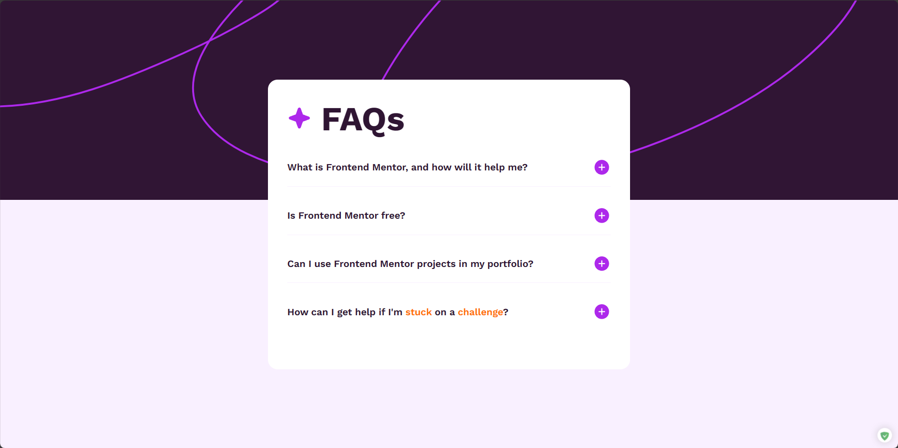

# Frontend Mentor - FAQ accordion solution

This is a solution to the [FAQ accordion challenge on Frontend Mentor](https://www.frontendmentor.io/challenges/faq-accordion-wyfFdeBwBz). Frontend Mentor challenges help you improve your coding skills by building realistic projects.

## Table of contents

- [Overview](#overview)
  - [The challenge](#the-challenge)
  - [Screenshot](#screenshot)
  - [Links](#links)
- [My process](#my-process)
  - [Built with](#built-with)
  - [What I learned](#what-i-learned)
  - [Continued development](#continued-development)
  - [Useful resources](#useful-resources)
- [Author](#author)

## Overview

### The challenge

Users should be able to:

- Hide/Show the answer to a question when the question is clicked
- Navigate the questions and hide/show answers using keyboard navigation alone
- View the optimal layout for the interface depending on their device's screen size
- See hover and focus states for all interactive elements on the page

### Screenshot



### Links

- Solution URL: [faq-accordion](https://github.com/lidamaomao/faq-accordion)
- Live Site URL: [Live Site](https://faq-accordion-chi-cyan.vercel.app/)

## My process

### Built with

- Flexbox

- [React](https://reactjs.org/) - JS library

### What I learned

Using the keyboard to control the page operation FAQ List is the first time I have written this code, and it is very challenging for me

```react
  const [isKeyboardNavigation, setIsKeyboardNavigation] = useState(false);

  const handleClickVisible = () => {
    setVisible(!visible);
  };

  const handleMouseDown = (event: { preventDefault: () => void }) => {
    event.preventDefault();
    setIsKeyboardNavigation(false);
  };

  const handleKeyPress = (event: { key: string }) => {
    if (event.key === "Enter" || event.key === " ") {
      setVisible(!visible);
    }
  };

  useEffect(() => {
    const handleKeyDown = (event: {
      key: string;
      preventDefault: () => void;
    }) => {
      if (event.key === "ArrowUp") {
        event.preventDefault();
        setVisible(true);
        setIsKeyboardNavigation(true);
      } else if (event.key === "ArrowDown") {
        event.preventDefault();
        setVisible(false);
        setIsKeyboardNavigation(true);
      }
    };

    document.addEventListener("keydown", handleKeyDown);

    return () => {
      document.removeEventListener("keydown", handleKeyDown);
    };
  }, []);

 return (
    <div
      className={`${visible ? "active" : ""} faq`}
      onClick={handleClickVisible}
      onKeyDown={handleKeyPress}
      onMouseDown={handleMouseDown}
      tabIndex={0}
      role="button"
    >
      <div className="title">
        <h3>{faq}</h3>
        {visible ? (
          
        ) : (
          
        )}
      </div>
      <div className="content">
        <p>{answer}</p>
      </div>
    </div>
  );
```

### Continued development

I have no knowledge of WAI at all, and may continue to strengthen this skill in the future.

### Useful resources

- [Accessibility in React](https://developer.mozilla.org/en-US/docs/Learn/Tools_and_testing/Client-side_JavaScript_frameworks/React_accessibility) - This is an amazing article which helped me finally understand WAI-ARIA. I'd recommend it to anyone still learning this concept.

## Author

- Website - [lidamaomao](https://www.lidamao.top)
- Frontend Mentor - [@lidamaomao](https://www.frontendmentor.io/profile/lidamaomao)
- Twitter - [@lidamao789](https://www.twitter.com/lidamao789)
